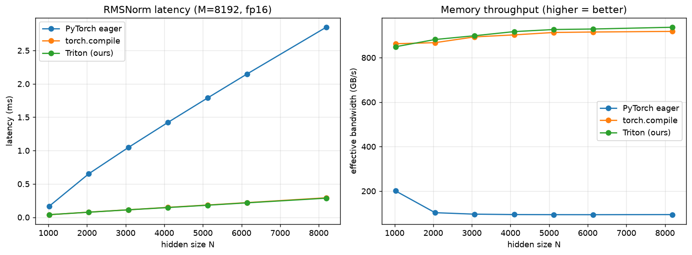

# triton-llm-kernels

**Fused [Triton](https://github.com/triton-lang/triton) kernels for the building blocks of modern LLMs — written from scratch, tested against PyTorch, and benchmarked.**

The normalization, positional-encoding and MLP ops inside a transformer are *memory-bound*: the math per element is cheap, so runtime is dominated by moving tensors in and out of GPU memory. Writing them as naive eager PyTorch pays for multiple passes over memory plus a kernel launch per op. This repo reimplements them as **single fused Triton kernels** — one load, one store, math in registers — and shows the speedup with reproducible benchmarks.

> Built as a hands-on study of GPU kernel programming for LLM inference. Every kernel comes with a correctness test against a PyTorch reference and a benchmark vs. eager + `torch.compile`.

---

## Kernels

| Kernel | Fwd | Bwd | Correctness test | Benchmark | Notes |
|---|:---:|:---:|:---:|:---:|---|
| **RMSNorm** | ✅ done | ✅ done | ✅ done | ✅ done | LLaMA/Mistral/Qwen norm |
| RoPE | ✅ done | ✅ done | ✅ done | in progress | rotary position embedding |
| SwiGLU MLP | ✅ done | ✅ done | ✅ done| in progress | fused gate·up·SiLU |
| LayerNorm | planned | planned | | | with bias |
| FlashAttention | planned | planned | | | causal + GQA (headliner) |
| FP8 GEMM | planned | — | | | Ada-native FP8 (4090+) |

## Why this is memory-bound (and why fusion wins)

For RMSNorm on an `[M, N]` tensor you must read `M·N` elements and write `M·N`
back. That's the floor. Eager PyTorch does extra round-trips (squaring, mean,
rsqrt, multiply) and launches several kernels. The fused kernel hits the floor:
each row is read once into registers, normalized, and written once. The right
metric is therefore **effective bandwidth (GB/s)** — how close we get to the
GPU's peak — not FLOP/s.

## Results

Benchmarked on an RTX 4090 (fill in after running `make bench`):



```
RMSNorm  |  M=8192  dtype=fp16  GPU=NVIDIA GeForce RTX 4090

     N |  eager ms  compile ms  triton ms | triton GB/s  speedup
------------------------------------------------------------------
  ...run `python benchmarks/bench_rmsnorm.py` to populate...
```

## Quickstart

```python
import torch
from triton_llm_kernels import rmsnorm, TritonRMSNorm

x = torch.randn(8, 2048, device="cuda", dtype=torch.float16)
w = torch.randn(2048, device="cuda", dtype=torch.float16)

y = rmsnorm(x, w)                      # functional, autograd-ready
layer = TritonRMSNorm(2048).cuda()     # or as an nn.Module
y = layer(x)
```

### Install

```bash
git clone https://github.com/Anetisa/triton-llm-kernels
cd triton-llm-kernels
pip install -e .        # torch + triton (triton ships with torch on Linux)
```

### Test & benchmark

```bash
make test               # pytest; kernel tests need a CUDA GPU
make bench              # writes assets/rmsnorm_bench.png
```

## Developing without a local GPU

The kernels target CUDA, but the whole repo — including the **actual Triton
kernels** — can be validated on a CPU-only machine:

```bash
make test        # reference + property tests pass; kernel tests skip (no GPU)
make test-cpu    # runs the Triton kernels on CPU via the interpreter
```

`make test-cpu` sets `TRITON_INTERPRET=1`, which executes the real kernel code
(indexing, masks, reductions, `atomic_add`) on CPU tensors and checks it against
the PyTorch reference — forward *and* backward. It's slower than a GPU but
catches logic bugs before you ever rent one. The full suite runs in a few
seconds.

- The **PyTorch reference** (`rmsnorm_reference`) and its **property tests** run
  on CPU with no Triton at all, so `pytest` is never a no-op locally.
- Kernel tests **skip cleanly** with no GPU present, or **run under the
  interpreter** when `TRITON_INTERPRET=1` is set.
- Rent a GPU (e.g. an RTX 4090 by the hour) only for tuning and final
  benchmarks — correctness is fully checkable on CPU first.

## Project structure

```
src/triton_llm_kernels/   kernels + autograd wrappers + references
tests/                    correctness tests (CPU reference + GPU kernel)
benchmarks/               perf comparisons with plots
docs/                     per-kernel write-ups (the math + why it's fast)
```

## Roadmap

This repo is built **incrementally** — each kernel is a self-contained unit
(kernel → test → benchmark → write-up), so the tree is always in a working
state.

- [x] Project scaffold, CI-friendly test harness, benchmark tooling
- [x] **RMSNorm** forward + backward, tests, benchmark, [write-up](docs/rmsnorm.md)
- [x] RoPE (rotary embeddings), interleaved + neox layouts
- [x] Fused SwiGLU MLP
- [ ] LayerNorm (with bias) + grouped/locked weight-grad reduction
- [ ] **FlashAttention**: online-softmax, causal mask, GQA/MQA
- [ ] FP8 GEMM using Ada-native FP8 tensor cores (RTX 4090+)
- [ ] Autotuning configs + a short blog-style write-up per kernel

## References

- Zhang & Sennrich, *Root Mean Square Layer Normalization* (2019)
- Dao et al., *FlashAttention* (2022) and *FlashAttention-2* (2023)
- The official [Triton tutorials](https://triton-lang.org/main/getting-started/tutorials/index.html)

## License

MIT — see [LICENSE](LICENSE).
