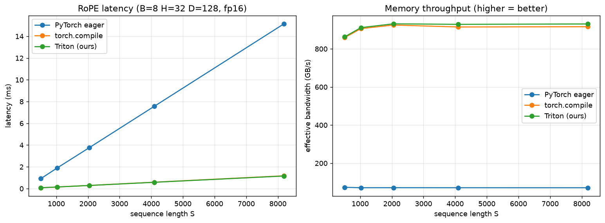
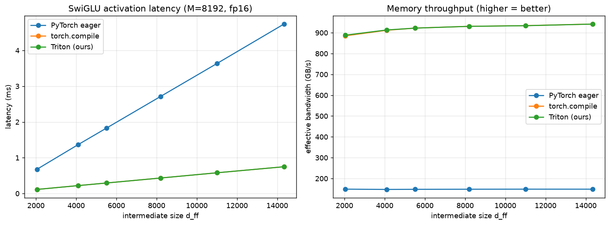
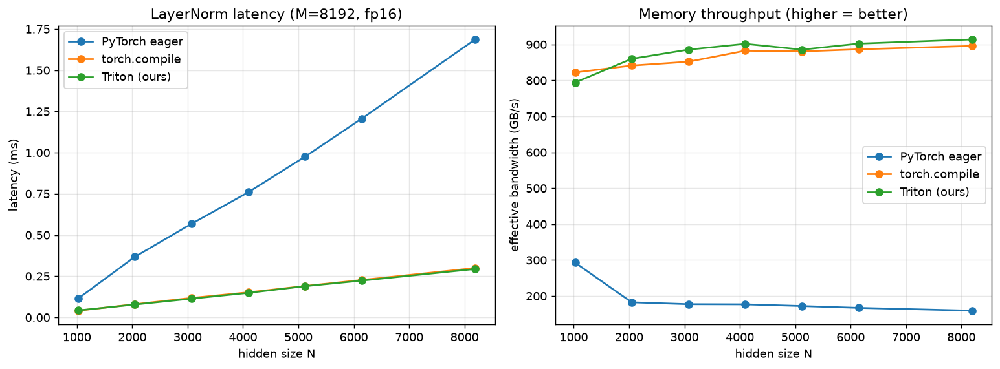
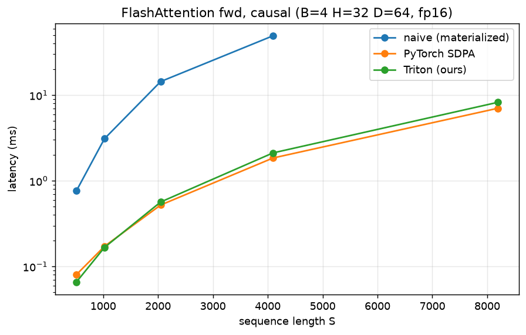
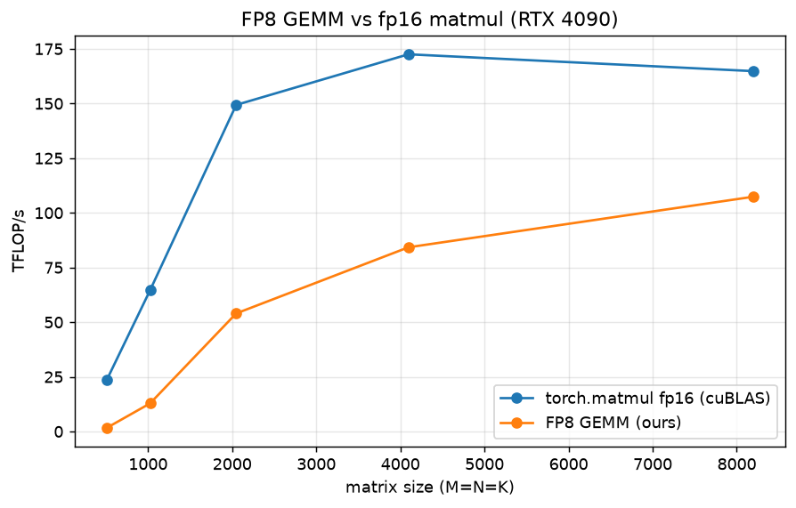

# triton-llm-kernels

**Fused [Triton](https://github.com/triton-lang/triton) kernels for the building blocks of modern LLMs — written from scratch, tested against PyTorch, and benchmarked on an RTX 4090.**

The normalization, positional-encoding and MLP ops inside a transformer are *memory-bound*: the math per element is cheap, so runtime is dominated by moving tensors in and out of GPU memory. Writing them as naive eager PyTorch pays for multiple passes over memory plus a kernel launch per op. This repo reimplements them as **single fused Triton kernels** — one load, one store, math in registers — and adds a from-scratch **FlashAttention** (forward + backward, causal, GQA/MQA) and an **FP8 GEMM** as the headliners.

> Built as a hands-on study of GPU kernel programming for LLM inference and training. Every kernel comes with a correctness test against a PyTorch reference and a reproducible benchmark. It's also designed to be developed **without a local GPU** — see below.

---

## Kernels

| Kernel | Fwd | Bwd | Correctness test | Benchmark | Notes |
|---|:---:|:---:|:---:|:---:|---|
| **RMSNorm** | ✅ | ✅ | ✅ | ✅ | LLaMA/Mistral/Qwen norm |
| **RoPE** | ✅ | ✅ | ✅ | ✅ | rotary position embedding (rotate_half) |
| **SwiGLU MLP** | ✅ | ✅ | ✅ | ✅ | fused SiLU(gate) * up |
| **LayerNorm** | ✅ | ✅ | ✅ | ✅| with bias; lock-grouped weight-grad reduction  |
| **FlashAttention** | ✅ | ✅ | ✅ | ✅ | online-softmax, causal, fwd+bwd, GQA/MQA |
| **FP8 GEMM** | ✅ | — | ✅ | ✅ | Ada-native FP8, per-tensor scaling |

## Why memory-bound — and the compute-bound exceptions

For RMSNorm on an `[M, N]` tensor you must read `M·N` elements and write `M·N` back. That's the floor. Eager PyTorch does extra round-trips (squaring, mean, rsqrt, multiply) and launches several kernels. The fused kernel hits the floor: each row is read once into registers, normalized, and written once. The right metric for these ops is therefore **effective bandwidth (GB/s)** — how close we get to the GPU's peak — not FLOP/s.
   
Two kernels are the exception. **FlashAttention** and **FP8 GEMM** are
**compute-bound** (dominated by matmuls on the Tensor Cores), so they're measured by latency / TFLOP/s against PyTorch's SDPA and cuBLAS rather than by bandwidth.

## Results

All kernels benchmarked on an RTX 4090 (fp16; bf16 nearly identical, plots in
[`assets/bf16/`](assets/bf16)). The four memory-bound kernels (RMSNorm, RoPE,
SwiGLU, LayerNorm) reach ~90% of the card's ~1 TB/s peak bandwidth and match
`torch.compile`, beating eager PyTorch by **4–13×**. FlashAttention is
compute-bound and is benchmarked separately below.

### RMSNorm


```
RMSNorm  |  M=8192  dtype=fp16  GPU=NVIDIA GeForce RTX 4090

     N |  eager ms  compile ms  triton ms | triton GB/s  speedup
----------------------------------------------------------------
  1024 |    0.1672      0.0389     0.0395 |       849.0    4.23x
  2048 |    0.6530      0.0774     0.0761 |       881.6    8.58x
  3072 |    1.0468      0.1127     0.1120 |       898.6    9.34x
  4096 |    1.4223      0.1487     0.1464 |       917.2    9.72x
  5120 |    1.7879      0.1837     0.1811 |       926.5    9.87x
  6144 |    2.1482      0.2200     0.2168 |       928.8    9.91x
  8192 |    2.8485      0.2924     0.2866 |       936.7    9.94x
```

### RoPE



```
RoPE  |  B=8 H=32 D=128  dtype=fp16  GPU=NVIDIA GeForce RTX 4090

     S |  eager ms  compile ms  triton ms | triton GB/s  speedup
----------------------------------------------------------------
   512 |    0.9151      0.0784     0.0780 |       863.2   11.73x
  1024 |    1.8899      0.1487     0.1478 |       911.4   12.78x
  2048 |    3.7725      0.2913     0.2893 |       931.4   13.04x
  4096 |    7.5642      0.5891     0.5803 |       928.7   13.03x
  8192 |   15.1447      1.1765     1.1582 |       930.7   13.08x
```

### SwiGLU



```
SwiGLU activation  |  M=8192  dtype=fp16  GPU=NVIDIA GeForce RTX 4090

  d_ff |  eager ms  compile ms  triton ms | triton GB/s  speedup
----------------------------------------------------------------
  2048 |    0.6762      0.1137     0.1133 |       888.4    5.97x
  4096 |    1.3654      0.2208     0.2205 |       913.3    6.19x
  5504 |    1.8275      0.2933     0.2934 |       922.1    6.23x
  8192 |    2.7115      0.4326     0.4326 |       930.7    6.27x
 11008 |    3.6366      0.5793     0.5794 |       933.8    6.28x
 14336 |    4.7384      0.7482     0.7484 |       941.5    6.33x
```

### LayerNorm



```
LayerNorm  |  M=8192  dtype=fp16  GPU=NVIDIA GeForce RTX 4090

     N |  eager ms  compile ms  triton ms | triton GB/s  speedup
----------------------------------------------------------------
  1024 |    0.1146      0.0408     0.0423 |       794.2    2.71x
  2048 |    0.3681      0.0798     0.0780 |       860.3    4.72x
  4096 |    0.7595      0.1521     0.1488 |       901.9    5.10x
  6144 |    1.2060      0.2271     0.2231 |       902.4    5.40x
  8192 |    1.6866      0.2996     0.2937 |       914.1    5.74x
```

### FlashAttention (forward, causal)

Unlike the memory-bound kernels above, attention is compute-bound, so the
comparison is against a naive materialized attention and PyTorch's
`scaled_dot_product_attention` (SDPA). The kernel runs **11–25× faster than
naive** and comes **within ~15% of SDPA** — beating it at short sequences —
while naive attention **runs out of memory past 4k** (it materializes the full
S×S score matrix; FlashAttention never does).



```
FlashAttention fwd (causal)  |  B=4 H=32 D=64  dtype=fp16  GPU=NVIDIA GeForce RTX 4090

     S |   naive ms   sdpa ms  triton ms |  vs naive
----------------------------------------------------
   512 |     0.7625    0.0803     0.0658 |    11.60x
  1024 |     3.0981    0.1717     0.1667 |    18.58x
  2048 |    14.3985    0.5212     0.5655 |    25.46x
  4096 |    49.2615    1.8452     2.1165 |    23.28x
  8192 |        OOM     7.0200     8.2393 |      n/a
```

### FP8 GEMM

The only compute-bound kernel here. FP8 matmul competes with cuBLAS, so the
metric is TFLOP/s. A straightforward tiled kernel reaches **~107 TFLOP/s** on
large matrices — below cuBLAS fp16 (~165 TFLOP/s), because it has no software
pipelining, autotuning, or optimized layout. The point is to exercise Ada's FP8
tensor cores correctly (per-tensor scaling, fp32 accumulation, ~3.7% Frobenius
error — expected for e4m3), not to beat cuBLAS; the speedups come from the
optimizations in the roadmap.



```
FP8 GEMM (square M=N=K)  |  GPU=NVIDIA GeForce RTX 4090

  size |   fp16 ms    fp8 ms |  fp16 TFLOP/s  fp8 TFLOP/s
---------------------------------------------------------
   512 |    0.0113    0.1557 |          23.8          1.7
  1024 |    0.0333    0.1672 |          64.6         12.8
  2048 |    0.1150    0.3182 |         149.4         54.0
  4096 |    0.7967    1.6315 |         172.5         84.2
  8192 |    6.6712   10.2431 |         164.8        107.3
```

## Quickstart

```python
import torch
from triton_llm_kernels import rmsnorm, TritonRMSNorm, flash_attention, fp8_gemm

# --- a fused norm (functional or as an nn.Module) ---
x = torch.randn(8, 2048, device="cuda", dtype=torch.float16)
w = torch.randn(2048, device="cuda", dtype=torch.float16)
y = rmsnorm(x, w)                       # autograd-ready
y = TritonRMSNorm(2048).cuda()(x)       # or as a layer

# --- FlashAttention: q, k, v are [B, H, S, D] ---
# causal + GQA/MQA (K/V may have fewer heads than Q); forward & backward
q = torch.randn(2, 32, 1024, 64, device="cuda", dtype=torch.float16, requires_grad=True)
k = torch.randn(2,  8, 1024, 64, device="cuda", dtype=torch.float16, requires_grad=True)  # GQA: 8 KV heads
v = torch.randn(2,  8, 1024, 64, device="cuda", dtype=torch.float16, requires_grad=True)
out = flash_attention(q, k, v, causal=True)
out.sum().backward()                    # dQ, dK, dV

# --- FP8 GEMM on Ada FP8 tensor cores (per-tensor scaled) ---
a = torch.randn(4096, 4096, device="cuda", dtype=torch.float16)
b = torch.randn(4096, 4096, device="cuda", dtype=torch.float16)
c = fp8_gemm(a, b)                      # A @ B in fp8, fp32 accumulation
```

### Install

```bash
git clone https://github.com/Anetisa/triton-llm-kernels
cd triton-llm-kernels
pip install -e .        # torch + triton (triton ships with torch on Linux)
```

### Test & benchmark

```bash
make test               # pytest; kernel tests need a CUDA GPU
make bench              # RMSNorm benchmark -> assets/
# each kernel has its own script under benchmarks/, e.g.:
python benchmarks/bench_flash_attention.py --out assets/flash_bench.png
```

## Developing without a local GPU

The kernels target CUDA, but the whole repo — including the **actual Triton
kernels** — can be validated on a CPU-only machine:

```bash
make test        # reference + property tests pass; kernel tests skip (no GPU)
make test-cpu    # runs the Triton kernels on CPU via the interpreter
```

`make test-cpu` sets `TRITON_INTERPRET=1`, which executes the real kernel code
(indexing, masks, reductions, `atomic_add`, spin-locks, `tl.dot`, even fp8) on
CPU tensors and checks it against the PyTorch reference — forward *and* backward.
It's slower than a GPU but catches logic bugs before you ever rent one. The full
suite runs in about a minute.

- The **PyTorch references** and their **property tests** run on CPU with no
  Triton at all, so `pytest` is never a no-op locally.
- Kernel tests **skip cleanly** with no GPU present, or **run under the
  interpreter** when `TRITON_INTERPRET=1` is set.
- Rent a GPU (e.g. an RTX 4090 by the hour) only for tuning and final
  benchmarks — correctness is fully checkable on CPU first. Some effects are
  hardware-only (e.g. TF32 vs IEEE fp32 in `tl.dot`); those are noted in the docs.

## Project structure

```
src/triton_llm_kernels/   kernels + autograd wrappers + references
tests/                    correctness tests (CPU reference + GPU/interpreter kernel)
benchmarks/               perf comparisons with plots
docs/                     per-kernel write-ups (the math + why it's fast)
assets/                   benchmark plots (fp16 in root, bf16 in assets/bf16)
```

## Roadmap

This repo is built **incrementally** — each kernel is a self-contained unit
(kernel → test → benchmark → write-up), so the tree is always in a working
state.

- [x] Project scaffold, CI-friendly test harness, benchmark tooling
- [x] **RMSNorm** forward + backward, tests, benchmark, [write-up](docs/rmsnorm.md)
- [x] **RoPE** (rotary embeddings) forward + backward, tests, benchmark, [write-up](docs/rope.md)
- [x] **SwiGLU** fused activation forward + backward, tests, benchmark, [write-up](docs/swiglu.md)
- [x] **LayerNorm** (with bias) + grouped/locked weight-grad reduction, tests, benchmark, [write-up](docs/layernorm.md)
- [x] **FlashAttention** forward + backward (dQ/dK/dV), causal, online-softmax, tests vs SDPA + autograd, benchmark, write-up
- [x] **FlashAttention GQA/MQA** (fewer KV heads than Q heads; dK/dV sums each query group)
- [x] **FP8 GEMM** on Ada-native FP8 tensor cores, per-tensor scaling, norm-based tests, [write-up](docs/fp8_gemm.md)
- [ ] Autotuning configs (block sizes, `num_stages`) + per-row/col FP8 scaling
- [ ] A short blog-style write-up tying the kernels into one transformer block

## References

- Zhang & Sennrich, Root Mean Square Layer Normalization (2019)
- Shazeer, GLU Variants Improve Transformer (2020)
- Su et al., RoFormer: Enhanced Transformer with Rotary Position Embedding (2021)
- Dao et al., FlashAttention (2022) and FlashAttention-2 (2023)
- The official [Triton tutorials](https://triton-lang.org/main/getting-started/tutorials/index.html)

## License

MIT — see [LICENSE](LICENSE).
